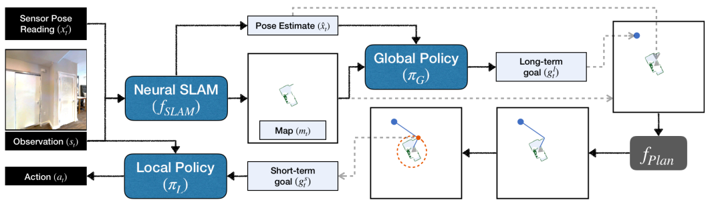
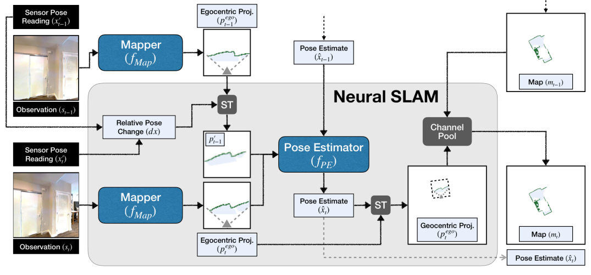

### 对这篇文章要解决的VLN任务进行分析：
ANSlam 解决的是在连续环境中 (论文在Habitat模拟器中进行实验) 、PointNav、No prior exploration (无导航前探索)的VLN任务。

论文主要解决了两个任务：探索 (Exploration) 和 PointGoal 导航。在PointGoal任务中，agent的目标是“导航到一个给定了相对坐标的目标位置” 。

### 论文研究动机：
这是一篇关于在未知3D环境中进行自主探索 (Exploration) 和 点目标导航 (PointGoal Navigation) 的论文。其核心贡献是提出了一种名为 "Active Neural SLAM" (ANS) 的模块化、分层式导航架构，它巧妙地融合了经典机器人导航方法（如SLAM、路径规划）和深度学习方法（如CNN、RL）的优势。

研究动机

论文的动机是解决纯粹的“端到端学习”和“经典几何方法”在导航任务中各自的缺陷：

端到端学习 (End-to-End Learning) 的缺陷：

- 将导航视为一个从“原始像素”直接到“动作”的端到端问题，在学习地图构建、状态估计和路径规划时，样本复杂度极高 (prohibitively expensive) 。

- 尽管使用了数百万帧的经验，但以往的端到端模型在探索任务上的表现甚至不如无需训练的经典方法 。

经典方法 (Classical Methods) 的局限：

- 灵活性差： 经典SLAM通常依赖专门的传感器（如深度相机或LIDAR）来感知几何信息，而学习型方法可以灵活地仅从RGB图像中推断几何信息 。

- 鲁棒性差： 对状态估计（如里程计）的错误很敏感 。

- 无法泛化： 无法利用真实世界环境（如室内布局）的“结构规律性” (structural regularities) 。

本文的核心思想： 不采用端到端的“蛮力学习”，而是将导航分解为一个模块化和分层(modular and hierarchical)的架构 。在经典的导航管线中“内部”地使用学习，从而在保留学习优势（灵活性、鲁棒性、利用结构）的同时，大幅降低样本复杂度。

### 论文提出的方法分析：

Memory building 方式: Explicit Memories (Metric Map-based Memory)

依据: 论文提出的 "Active Neural SLAM" (ANS) 模型“在内部显式地维护一个空间地图 $m_{t}$ (internally maintains a spatial map, $m_{t}$)” 。这个地图被定义为一个 $2 \times M \times M$ 的矩阵，其中两个通道分别代表“该位置是障碍物的概率”和“该位置被探索过的概率” 。这正是一个显式的、基于度量的占用栅格地图 (occupancy grid)

---

ANS模型由三个主要组件构成，它们通过一个显式的地图和一个经典的路径规划器连接起来。

图1：ANS 架构概览。

模型由三个学习模块（Neural SLAM, Global Policy, Local Policy）和一个经典模块（Planner）组成。

架构流程详解：
- Neural SLAM 模块 ($f_{SLAM}$) - [学习型]功能： 这是ANS的“眼睛”和“海马体”。它是一个学习到的SLAM模块，接收当前的RGB观测 ($s_t$) 和（带噪声的）传感器读数 ($x'$) 。

输出： 它预测两样东西：一个自顶向下的2D自由空间地图 ($m_t$)，标明了障碍物和已探索区域 。Agent当前的姿态估计 ($\hat{x}_t$) 。优势： 因为是学习到的，它可以仅凭RGB图像就完成地图构建。

图2：Neural SLAM 模块内部。它包含一个Mapper（从RGB预测小范围的自我中心地图）和一个Pose Estimator（通过对比前后帧的地图预测来修正姿态）。

全局策略 ($\pi_G$) - [学习型]功能： 这是ANS的“长期大脑”。它观察由Neural SLAM生成的整个全局地图 ($m_t$) 和agent的当前位置。

输出： 它利用学习到的对环境布局（如走廊、房间）的结构性理解，输出一个长期目标 ($g_t^l$) 31313131。示例： 在探索任务中，这个目标可能是“去地图另一端那个最远的未探索边界” 32323232。在PointGoal任务中，这个目标被固定为任务给定的坐标。

规划器 ($f_{Plan}$) - [经典型]功能： 这是一个分析性路径规划器 (analytical path planner) ，论文中使用了快速行进法 (Fast Marching Method, FMM) 。

输入： 全局策略给出的长期目标 ($g_t^l$) 和Neural SLAM生成的地图 ($m_t$) 。

输出： 它在地图上计算出一条到达长期目标的最短路径，并从这条路径上提取出一个短期目标 ($g_t^s$)（例如，沿着路径前方0.25米的点）。

局部策略 ($\pi_L$) - [学习型]功能： 这是ANS的“小脑”或“驾驶员”。它是一个反应式的策略，负责具体执行动作。

输入： 它只看当前的RGB观测 ($s_t$) 和那个短期目标 ($g_t^s$)（短期目标被转换为相对距离和角度）。

输出： 一个具体的导航动作（前进、左转、右转）。优势： 因为它依赖实时的视觉反馈（RGB），所以它对Neural SLAM的地图错误或姿态估计漂移具有很强的鲁棒性。例如，如果地图错误地将地毯预测为障碍物，规划器会规划绕路，但局部策略在观察RGB图像后，会意识到地毯可以通行，从而学会“走过”它。

---

### 训练流程

ANS的模块化设计允许采用不同的方式独立训练各个组件，所有模块被同时训练 (trained simultaneously)。

Neural SLAM 模块 ($f_{SLAM}$):使用监督学习 (Supervised Learning) 。Mapper（地图构建器）的标签（Ground Truth）来自模拟器中真实的几何投影。

Pose Estimator（姿态估计器）的标签来自模拟器中真实的agent姿态 。

全局策略 ($\pi_G$):使用强化学习 (Reinforcement Learning)（具体为PPO算法）进行训练 。

奖励 (Reward): 在探索任务中，奖励被设置为“探索覆盖面积的增加量” (increase in coverage) 。

局部策略 ($\pi_L$):使用模仿学习 (Imitation Learning)（即行为克隆）进行训练。“专家”数据由一个使用FMM规划器和真实地图（Ground Truth Map）的确定性策略生成。

