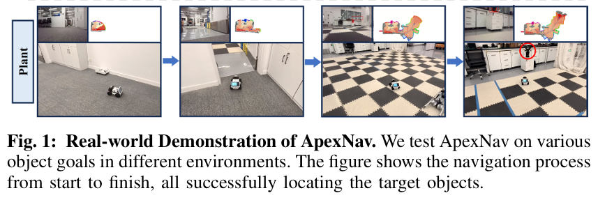
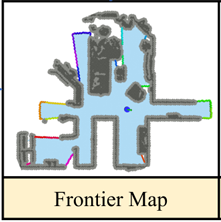
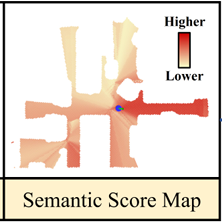
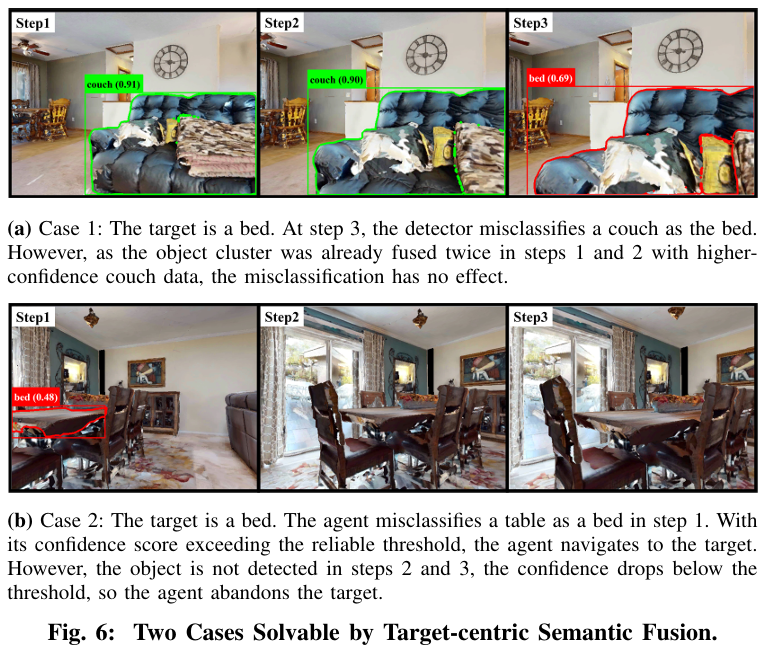
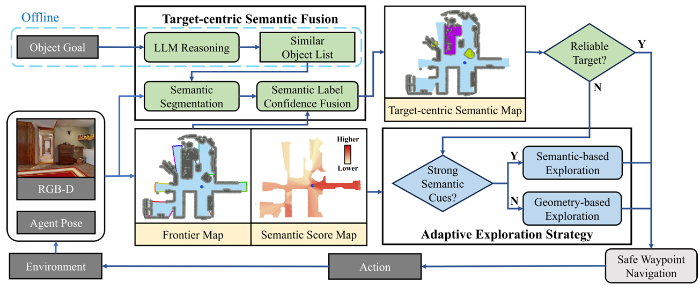

### 对这篇文章要解决的VLN任务进行分析：
ApexNav 解决的是在连续环境中 (Habitat模拟器) 、object goal目标导向（数据集是HM3Dv1等）、No prior exploration (无导航前探索)的VLN任务。

论文在引言和问题定义中都明确指出，任务是要求agent在一个“未知环境 (unknown environment)”中导航。这意味着agent在导航开始前对测试环境没有先验知识，也没有进行过预先探索。

论文标题 和摘要 就明确将其定义为 "Object Navigation" (物体导航) 任务。任务要求agent导航到由类别指定的目标物体（例如“椅子” 或“厕所” ），而不是遵循详细的路径指令（Route-oriented）。

### 论文研究动机：
这是一篇关于零样本物体导航 (ZSON)  的论文。

1. 任务与挑战

任务定义: ZSON任务要求一个智能体（如机器人）在完全未知的环境中 ，仅根据一个物体类别名称（如“去马桶”），找到该物体。"零样本" (Zero-shot) 意味着agent没有在当前的测试环境中进行过任何训练 。

核心挑战: 现有的ZSON方法在效率和鲁棒性上存在严重问题 。

- 效率低下: 许多方法过度依赖语义线索（比如“床”在“卧室”）。但在导航初期（例如面对一堵白墙）或语义线索模糊时（例如“植物”可能出现在任何房间），这种方法会失效。
- 鲁棒性差: 现有的方法依赖单帧检测 ，或者使用简单的“最大置信度融合”来构建地图 。这导致系统非常脆弱，一个高置信度的错误检测（例如把沙发错当成床）就可能污染整个地图，且后续难以纠正 。

2. 研究动机

ApexNav的设计灵感来源于人类寻找物品的行为 ：
- 当线索不足时，人类会快速探索周围环境（几何探索）。
- 当线索明确时，人类会集中搜索特定区域（语义探索）。
- 当不确定是否找到目标时，人类会收集更多证据（例如靠近点、换个角度看）再做决定，而不是立即下结论 。

### 论文提出的方法分析：

Memory building 方式: Map-based Memory(Explicit Memories) + Foundation Model-based 推理

依据:

显式度量地图 (Explicit Metric Map-based): ApexNav构建了多种显式的、基于度量地图的记忆。它在 "2D probabilistic grid" (2D概率栅格) 上构建 "Frontier Map" (前沿地图) 和 "Semantic Score Map" (语义得分地图) 。

显式物体记忆: 它还维护了一个 "Target-centric Semantic Map" (以目标为中心的语义地图)，通过物体聚类和融合 来存储每个物体的3D点云、置信度和检测量等详细信息 。

Foundation Model (推理): 论文严重依赖基础模型，但主要是将它们用于推理，而不是作为隐式记忆本身。例如，它使用LLM（大型语言模型）离线生成相似物体列表 ，并使用VLM（视觉语言模型，如BLIP-2 ）为显式的 "Semantic Score Map"  打分。这符合你定义中的“利用其广泛的预训练知识来推理导航步骤”。

---

Step 1: LLM离线推理:

在任务开始前，使用LLM进行推理。输入“床 (bed)”，LLM不仅返回“床”，还会返回一个相似物体列表 (Similar Object List)，如 "沙发 (couch)", "椅子 (chair)" 。

这意味着agent在寻找“床”的同时，也会特意去检测“沙发”和“椅子”，以防混淆。

Step 2: Frontier Map的构建
Frontier Map 是在机器人当前已知环境地图（occupancy grid）上提取 “前沿区域”（frontier regions） 的可视化结果。
它展示了：

灰色：已知的障碍物区域（occupied cells）；

蓝色：已知的可通行区域（free cells）；

白色或透明部分：未知区域（unknown cells）；

彩色线段：不同的 frontier cluster（待探索边界）。

如何构建？先建立 2D 占据栅格（Occupancy Grid Map）。机器人或模拟器在环境中移动时，会通过相机或深度传感器（如 RGB-D）感知周围环境。对于每个深度图像（Depth image），通过相机内参和位姿（pose），将深度图转换为点云（Point Cloud）。

使用raycasting 将这些点云投射到 2D 网格中：射线经过的区域标记为 “free”（可通行）；射线终点对应的点标记为 “occupied”（障碍物）；未观测到的区域保持为 “unknown”。这就得到了一个概率占据网格（2D probabilistic grid），通常是一个矩阵形式。然后通过一系列去噪等处理，进行前沿检测：比如，如果某个 cell 是 free，但它的 4-邻域或 8-邻域中有 unknown cell，则该 cell 属于 frontier。然后聚类处理...

这个map和之后的map一样，都是会逐步探索扩充的。

Step 3: Semantic Score Map的构建

这是主要的视觉感知部分。
Semantic Score Map 是一个2D地图，它用来显示环境中各个位置与目标物体（例如“马桶”）的相关程度。得分越高的区域，意味着与目标物体的相关性越强。

其生成步骤如下：VLM打分： 核心工具是预训练的视觉语言模型（VLM）BLIP-2。Agent会将当前的 RGB图像 和一个文本提示 (text prompt) 一起输入到BLIP-2中。生成文本提示：这个文本提示是经过设计的。首先，系统会使用大型语言模型（LLM）来推断目标物体最可能出现的房间名称（例如，目标是“床”，LLM会推断出“卧室”）。然后，它会生成类似 Seems there is a <target_object> or a <target_room> ahead (例如：“前方似乎有一个<床>或一个<卧室>”) 这样的提示。如果目标物体（如“植物”）不与特定房间绑定，则提示中只包含该物体。

获取相似度得分： BLIP-2会通过图像-文本匹配，输出一个余弦相似度得分。这个得分代表了当前视野与文本提示的匹配程度。投影到地图： 得到的这个分数会被投影到Agent观察到的、地图上的空闲栅格 (free grids) 上。置信度加权： 投影的分数会根据视角进行加权。靠近光轴（即视野中心）的栅格会获得更高的置信度。随着与光轴的角度偏移越大，置信度会随之降低，具体的权重计算公式为 $cos^{2}(\frac{\theta}{\theta_{Fov}/2}\cdot\frac{\pi}{2})$ 。多帧融合： 为了整合来自多帧的信息，地图上的语义分数会通过一个置信度加权的平均来进行更新 。同时，置信度分数本身也会被更新，这个更新会通过平方加权来突出（emphasize）更可信的预测。

Step 4: 自适应探索策略 (Adaptive Exploration Strategy)

该模块用于解决“效率低下”的问题，它能智能地在两种探索模式间切换。模式切换标准: 系统会实时分析 "Semantic Score Map" (语义得分地图) 的分数分布。

线索强 (切换至语义探索): 如果发现某些区域的语义得分远高于平均值（通过高“最大-均值比” $r$ 和高“标准差” $\sigma$ 来判断），说明找到了“热点区域”。

线索弱 (切换至几何探索): 如果得分分布很均匀（例如刚开局面对白墙），说明语义线索不可靠。

- 语义探索模式 (Semantic-based):为了避免在多个高分点之间来回奔波，ApexNav不只是贪婪地选择最高分点。它将所有高分的前沿点 (frontiers) 建模为一个旅行商问题 (TSP) ，并使用LKH解算器规划出一条最高效的“串门”路径。
- 几何探索模式 (Geometry-based):采用最高效的 "nearest-frontier" (最近前沿点) 策略，快速移动到最近的未知区域边界，以最快速度收集新信息。

---

Frontier Map 提供了Agent可以探索的未知区域边界，而 Semantic Score Map 提供了这些区域与目标的语义相关性。有了这两张地图后，Agent的下一步行动取决于它是否已经找到了一个“可靠的目标” 。

- 场景一：如果“可靠目标”未被找到

如果尚未找到可靠的目标，Agent就需要继续探索。此时，系统会启动自适应探索策略来选择下一个要去的前沿点（frontier waypoint）。这一策略的具体步骤如下：

分析语义分布： Agent会分析 Frontier Map 上所有前沿簇 (frontier clusters) 的语义得分分布。

分配分数： 每个前沿点会根据它在 Semantic Score Map 上的位置被赋予一个语义分数。

计算统计指标： 系统会计算所有前沿点分数的两个关键指标：最大-均值比 $r$ ($r=s_{max}/\overline{s}$) ：衡量是否存在得分远高于平均分的前沿点。标准差 $\sigma$ ：衡量分数的离散程度，即语义相关性是否分布不均。

切换探索模式：如果 $r$ 和 $\sigma$ 都很高（超过设定的阈值 $r_{t}$ 和 $\sigma_{t}$）：这说明环境中存在“强语义线索”。Agent会切换到语义探索 (Semantic-based Exploration) 模式，优先探索那些高分区域(通过旅行商算法，找到一条高效访问所有高分区域的路径)。否则（如果线索很弱或很均匀）：Agent会默认使用几何探索 (Geometry-based Exploration) 模式，以快速扩展地图覆盖范围。

Step 5: Target-centric Semantic Map的构建和目标定位 (Object Localization)

Target-centric Semantic Map (以目标为中心的语义地图) 不是一张像Semantic Score Map那样的2D栅格地图，它更像是一个动态的物体数据库。它的目的就是防止你把最终目标认错，认成长得很像的其它类别。它的核心是论文中提到的“Object Clusters” (物体簇)。这个地图的构建和更新过程（即 Target-centric Semantic Fusion）非常精妙，结合了离线推理和在线融合：

- 步骤一：(step 1说过)离线推理 (准备工作)在导航任务开始前，系统会使用一个大型语言模型 (LLM) 进行推理 2222。目的： 不仅仅是知道要找“床”，还要知道哪些东西容易被错认成“床”。输出： LLM会生成一个物体列表 $L_{obj}$ ，其中包含：目标物体 (例如：bed)。相似物体 (例如：couch, chair) 。一个自适应的置信度阈值 $c_{th}$ (例如：0.65)，用于判断何时算“可靠地”找到了目标。

- 步骤二：在线检测与分割 (收集数据)在导航的每一步，Agent获取当前的RGB-D图像。它使用物体检测器（如YOLOv7或Grounding-DINO）来检测列表 $L_{obj}$ 上的所有物体（即同时寻找bed, couch, chair）。检测到的物体会被分割 (Mobile-SAM)，并从深度图中提取出对应的3D点云。

- 步骤三：在线融合与更新 (构建地图)这是最核心的一步。系统会维护一个“Object Clusters” (物体簇) 的集合，这就是Target-centric Semantic Map的实体。物体簇结构： 每一个“簇”代表了在物理世界中观察到的一个独立物体（比如你家客厅的沙发）。这个簇内部为每个可能的标签（bed, couch, chair）都保留了信息。它存储的内容包括：该标签的3D点云 $pt_{o}^{l}$ 。该标签的融合置信度 $c_{o}^{l}$ 11。该标签的累积检测体积 $n_{o}^{l}$ (即观察到的点云数量)。

融合逻辑：匹配： 当新检测到一个物体（例如，检测器以 0.8 的置信度认为看到了couch），系统会将其点云投影到地图上，看它是否与已有的“物体簇”相交。更新/创建：如果不相交，就创建一个新的“物体簇” 。如果相交（意味着之前见过这个物体），则进行融合。加权平均： 融合不是取最大值。系统会根据“检测体积”（点云数）作为权重，将新的检测置信度（0.8的couch）与该簇中couch标签的旧有置信度进行加权平均。这使得观测次数更多、面积更大的检测结果更有分量。

关键的纠错机制 (置信度惩罚)：场景： Agent的视野 (FoV) 覆盖了某个已知的“物体簇”（例如之前误以为是bed的沙发），但当前帧的检测器没有检测到bed（或者将其正确识别为了couch）。操作： 系统会认为这表明之前的bed检测可能是错的。它会施加一个置信度惩罚：在这一帧，它会强制设置bed标签的当前检测置信度 $c_{det}$ 为 0。结果： 这个“0”分会被加权平均融合到bed标签的总置信度中，导致该簇被识别为bed的置信度下降。这就是图6(b)中，Agent放弃错误目标的原因。

全过程图：
