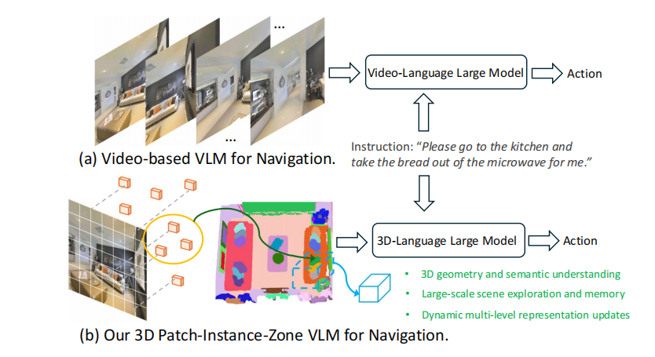

### 对这篇文章要解决的VLN任务进行分析：
Dynam3D 解决的是在连续环境中、route/object goal兼容、No prior exploration，但模型框架支持Pre-recorded prior exploration的VLN任务。

论文在 R2R-CE 数据集上表现出色 ，该数据集提供的是“step-by-step and following instructions”；论文也在 REVERIE-CE 和 NavRAG-CE 上取得了 SOTA 。REVERIE-CE 使用的是“coarse-grained and high-level destination description”（粗粒度和高级别的目标描述）。论文中给出的示例指令，如“请去厨房把微波炉里的面包拿给我” 或“请把椅子上的那个装满苹果的白色水果碗拿给我” ，都属于“Goal-oriented”任务，agent 需要自行规划路径找到目标物体。

### 论文研究动机：
近期的 VLN 任务开始大量使用基于视频的大型语言模型 (Video-VLMs) 。尽管这些模型在语言理解和常识推理上很强，但在真实的 3D 导航中暴露了三大挑战 ：

- 缺乏 3D 理解： 基于 2D 视频帧的模型难以捕捉 3D 空间的几何结构和语义 。
- 缺乏长期记忆： 它们没有结构化的场景记忆机制，导致在大规模探索和纠错时能力有限 。
- 动态适应性差： 依赖历史帧的表征，无法适应 3D 场景中物体移动或被移除的动态变化 。

如下图所示，(a) Video-VLM 仅处理 2D 帧序列，而 (b) 本文提出的 3D-VLM 则构建了一个显式的 3D 场景表征来进行导航 。

### 论文提出的方法分析：
Memory building 方式: Map-based Memory+Latent Representation-based

它并不构建传统的“显式记忆”（如栅格地图或拓扑图）。相反，它构建了一种动态的、分层的 3D 令牌，即“3D Patch-Instance-Zone Tokens” 。这些 3D 令牌随后与指令令牌、历史动作令牌一起被送入一个 3D-VLM（具体为 LLaVA-Phi-3-mini）。这些3D令牌的生成用的是RGB-D图像，由语义嵌入和位置嵌入组成，所以感觉和构建了地图没啥区别。并且论文中也画了一个3D点云patch feature图。

---
全流程

Step 1: 补丁层 (Patch-level) - 动态更新

这是最底层的表征，负责感知和更新 3D 场景。特征点编码： 使用 CLIP-ViT 从 RGB 图像中提取 2D 补丁特征 (Patch features) 。也就是一张图片被ViT分割成很多patch，每个patch都有一个特征嵌入。

3D 投影： 利用深度图和相机位姿，将这些 2D patch 特征投影到 3D 世界坐标中，形成“补丁特征点” (Patch Feature Points)，存储在一个集合 $\mathcal{M}$ 中。

动态更新 (核心)： 当机器人移动时，模型采用“视锥剔除 (Frustum Culling)”策略。它会检查内存中旧的特征点是否还在当前视野内，如果一个旧点（如被移走的凳子）的位置被新的观测（如地板）“看穿”了（即新深度远大于旧深度），该旧点就会被删除。这使得模型能够适应动态变化的环境。

Step 2: 实例层 (Instance-level) - 语义聚合

补丁层的特征点太多（数万个），计算开销大 。并且因为任务本身以及自然语言指令很多也是以实例为单位叙述的。因此，模型需要将其聚合成物体级别的“实例”表征。

2D 实例特征： 使用 FastSAM 对当前 2D 图像进行分割，得到物体掩码 (masks) 。然后用一个 "Instance Encoder"（实例编码器）将掩码内的所有 patch 特征聚合为一个 2D 实例特征 。

3D 实例特征： 引入一个“合并判别器 (Merging Discriminator)” 。当从新视角看到一个 2D 实例时，判别器会判断它是否与内存中已有的 3D 实例（从旧视角看到的）是同一个物体。

如果是，就将新的 2D 实例特征合并 (merge) 到已有的 3D 实例中，并更新其 3D 特征 。

如果不是，就创建一个新的 3D 实例 。

step3: 区域层 (Zone-level) - 布局理解

实例层只关注物体，但无法理解“卧室”、“厨房”这样的大尺度空间布局 。区域编码： 模型将 3D 世界划分为均匀的立方体区域 (Zone)，并使用一个 "Zone Encoder" 进一步聚合该区域内的所有 3D 实例特征，从而得到代表大尺度空间布局的“区域令牌” 。但实际上论文中提到是把一帧图像中的所有3D实例聚合起来，而非严格按照立方体区域。

step4: 3D-VLM 决策

最后，模型将这三层 3D 令牌送入 VLM (LLaVA-Phi-3-mini) 进行决策：

全景补丁令牌： 首先，模型使用所有“补丁特征点”构建一个“可泛化特征场”，并从中渲染 (render) 出机器人当前位置的 360° 全景图，生成 $12 \times 48$ 个 3D 补丁令牌 。

输入 VLM： 将 {全景补丁令牌} + {3D 实例令牌} + {3D 区域令牌} + {指令} + {历史动作} 一起输入 3D-VLM 48。

输出动作： VLM 推理并预测下一个导航动作。

---
训练流程：

- 阶段一：3D 表征模型预训练目标： 训练实例编码器 (Instance Encoder) 和区域编码器 (Zone Encoder)，使其输出的 3D 特征能与语言语义对齐。

方法： 使用多个损失函数：实例-文本对齐 (公式 5): 利用 3D-语言数据集，通过对比学习，强迫 3D 实例特征 ($\mathcal{O}_{i}$) 与其对应的文本描述特征 ($\mathcal{T}_{i}$) 在语义空间中拉近。

子空间蒸馏 (公式 7): 论文发现，直接从 2D CLIP 蒸馏特征（公式 6）会受到视角偏差的严重干扰。因此，他们提出了一种“子空间对比学习”，在对比前先减去当前视图的“语义中心”($\mathcal{V}_{j}$)，从而消除视角偏置，学习到更稳健的 3D 表征。

- 阶段二：3D-VLM 导航训练

目标： 训练 VLM 学会看懂 3D 令牌并执行导航指令。

方法： 在 400 万+的导航数据上进行训练 。

模仿学习： agent 严格跟随专家路径，学习基础的指令跟随能力 。

探索与纠错 (DAgger)： 故意引入随机偏差，让 agent 偏离路径，然后训练它如何纠正错误并返回正确轨迹 。

