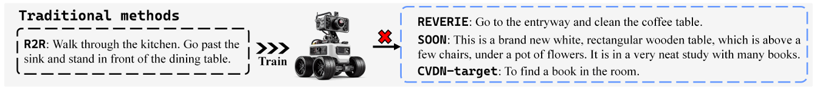
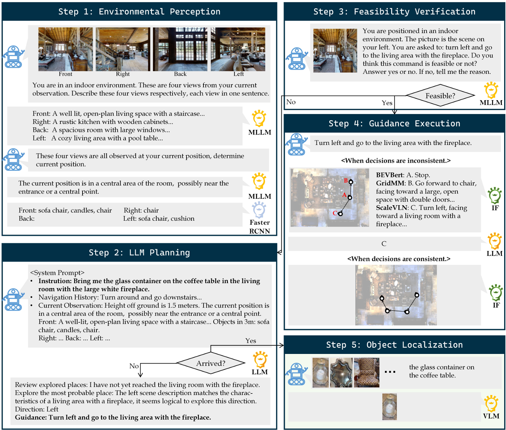

### 对这篇文章要解决的VLN任务进行分析：
FlexNav 解决的是在离散环境中 (R2R 数据集) 、基于REVERIE, SOON, CVDN-target这种object goal目标导向（用论文的方法，可以从R2R route goal泛化而来）、No prior exploration (无导航前探索)的VLN任务。

论文在 "III. PROBLEM FORMULATION" 部分明确指出，它采用了离散环境下的标准 VLN 设置（"standard VLN setup for discrete environments [1]"）1。环境被定义为一个无向图 $\mathcal{G}=\{\mathcal{V},\mathcal{E}\}$，其中 $\mathcal{V}$ 是可导航节点，$\mathcal{E}$ 是连通边 2。Agent 的动作空间是在当前节点的相邻节点中选择下一个节点 $V_{t+1}\in\mathcal{N}(V_{t})$ 3。

论文的实验设置是在 "validation unseen set"（验证集未见环境）和 "validation unseen house set"（验证集未见房屋） 上评估模型的泛化能力。这符合 "No prior exploration" 的定义，即 Agent 在测试时被要求在全新的、之前未见过的环境中导航，仅依赖当前指令和导航过程中的在线观察。

### 论文研究动机：
研究动机：解决“泛化难”问题
当前的 VLN 方法面临两大困境：

- 监督学习方法 (Supervised methods) 缺乏泛化性： 在一个数据集（如 R2R，提供分步指令 ）上训练的模型，无法直接处理另一类数据集（如 REVERIE，提供高级目标指令 ）的任务 。它们需要针对特定数据集进行微调 。

- 大型语言模型方法 (LLM-based methods) 性能不佳： 尽管 LLM 拥有强大的推理和泛化能力 ，但现有的纯 LLM 导航方法（如 NavGPT ）在导航任务上的性能远不如监督方法 ，且资源消耗巨大（需要在每一步都调用LLM） 。

FlexVLN 的核心思想是结合两者的优点：利用 LLM 的泛化推理能力进行高层规划，利用监督模型的精准导航能力进行底层执行 。

(图1展示：传统方法 在 R2R 上训练后，无法泛化到 REVERIE 等任务。而 FlexVLN 结合了 Instruction Follower 和 LLM Planner ，无需额外训练 即可处理域内 (In-domain ) 和域外 (Out-of-domain ) 的指令。)

### 论文提出的方法分析：

Memory building 方式: Foundation Model-based (基础模型驱动) + Explicit Memories (显式记忆)

依据： FlexVLN 是一个分层系统 ，它在不同层级同时使用了两种记忆方式：

Foundation Model-based (高层规划): 系统的 "LLM Planner"（LLM规划器）负责高层规划。它利用大型语言模型（如 GPT-4o ）来编码场景（通过文本描述 ）、指令和"navigation history H"（导航历史）。LLM 依赖其强大的预训练知识（即 "robust reasoning and generalization abilities" ）来推理下一步的去向 ，这符合 "Foundation Model-based" 的定义。

Explicit Memories (底层执行): 系统的 "Instruction Follower"（指令跟随者）负责执行 LLM 生成的细粒度指导。这个跟随者是三个模型的集成 ，其中包括以 "excellent mapping ability"（出色建图能力）著称的 GridMM 。此外，论文的消融实验 (Table VII) 明确验证了在执行指导时保留 "topological memory map"（拓扑记忆地图）的重要性 。这符合 "Metric Map-based Memory" 或 "Graph-based memory" 的显式记忆定义。

Step 1: 环境感知 (Environmental Perception)

Agent 使用多模态模型 (MLLM, 如 InternVL ) 来理解当前的四个朝向的视图 ，生成场景描述 和当前位置的推断 。同时使用物体检测器 (Faster R-CNN ) 识别3米内的物体 。这些描述和Faster R-CNN识别出来的物体会通过prompt engineering丢给LLM做规划

Step 2: LLM 规划 (LLM Planning)

核心步骤： LLM Planner (如 GPT-4o ) 接收原始的、高级的 (OOD) 指令（例如 "Bring me the glass container..." ）、导航历史 和刚感知的当前观察 。

LLM 进行推理 （如分析已探索区域、判断目标方向 ），然后生成一个细粒度的指导 (Guidance) 。这个指导被约束在 Instruction Follower 能理解的动作空间内（如 "Turn left and go to the living area..." ）。

Step 3: 可行性验证 (Feasibility Verification)

为了防止 LLM 产生"幻觉"（如指令穿过一堵墙），系统使用一个 MLLM (Qwen2-VL ) 来验证上一步生成的指导是否可行 。如果 MLLM 回答 "Yes" ，则进入下一步；如果 "No"，则返回 Step 2 让 LLM 重新规划 。

Step 4: 指导执行 (Guidance Execution)

多模型集成： Instruction Follower 由三个在 R2R 上预训练好的 SOTA 模型（BEVBert, GridMM, ScaleVLN ）集成。

它们负责执行 Step 2 中那个细粒度的指导（"Turn left and go..." ）。

一致性检查：

如果三个模型动作一致 ，则直接执行 。

如果动作不一致 （例如，一个说"Stop"，一个说"Go forward"，一个说"Turn left" ），则再次调用一个 LLM (GPT-40-mini )，让它根据指导选出最佳动作 。

执行完成后，返回 Step 1，直到 LLM Planner 判断已到达目的地 。

Step 5: 目标定位 (Object Localization)

导航停止后，Object Locator (使用 VLM 如 BLIP-2 ) 负责在当前视图中找出指令中提到的最终目标物体（例如 "the glass container on the coffee table" ）。

