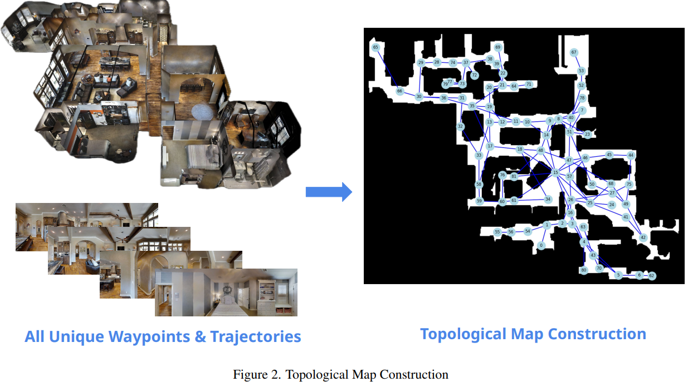
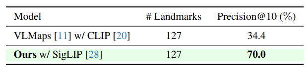
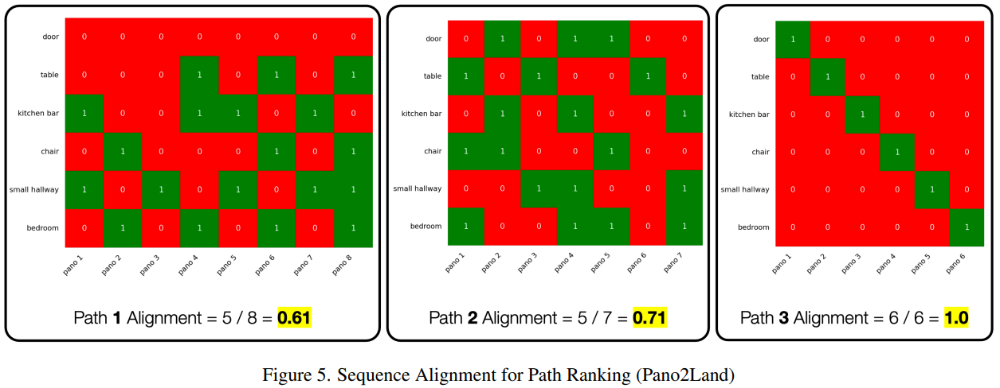

### 对这篇文章要解决的VLN任务进行分析：
TRAVEL 解决的是在离散环境中 (R2R 数据集) 、基于详细路由指令 (Route-oriented)、且已提前探索并构建了拓扑地图 (Pre-recorded exploration) 的VLN任务。

论文明确指出其使用的是 R2R-Habitat (Room-2-Room) 数据集 。R2R 数据集是基于 Matterport3D 环境中的全景图像和航点 (waypoints) 构建的，这是一个图结构 (graph-based) 的离散环境。Agent的移动是在预定义的节点之间跳转。

论文的方法明确假设环境模型是已知的 (摘要中"Assuming the known model of the environment") 。Agent 会首先使用数据集的训练集来构建一个全局的拓扑地图 (topological map) 。在论文的 Limitations 部分也提到，该方法“只在先前探索过的、给定了拓扑地图的环境中有效” 。

### 论文研究动机：
本文的核心动机是提出一种模块化 (modular) 的VLN方法 ，该方法完全不需要任何特定于VLN任务的训练 。它旨在利用现有的、最先进的 (SOTA) 大型语言模型 (LLM) 和视觉语言模型 (VLM) 强大的零样本 (zero-shot) 能力 ，将复杂的VLN任务分解为一系列更简单的子模块（如指令解析、地标检索、路径对齐）。

### 论文提出的方法分析：

Memory building 方式: Explicit Memories (Graph-based memory)依据: 论文的方法依赖于一个显式构建的拓扑图G作为环境的全局记忆。这个图的节点由全景图表示，边代表节点间的连通性（如图1所示）。虽然该方法严重依赖大型模型 (LLM/VLM) 进行推理，但这些模型是用来理解指令和评估路径的，而不是作为环境的记忆结构本身。环境的记忆是通过显式的图来存储的。

Step 1: 拓扑地图构建 (Topological Map Construction)

在导航开始前，Agent 会使用R2R数据集的训练数据，遍历所有可用的航点 (waypoints) 和轨迹 (trajectories)，构建一个环境的全局拓扑图 G。在这个图中，每个节点都由一个 $360^{\circ}$ 的RGB全景图表示，边 $e$ 代表节点间的连通性。如上面的图1所示。

Step 2: 指令解析与目标检索 (Instruction Parsing & Goal Retrieval) 

给定一条自然语言指令（如 "Walk through the door and around the table.Turn left and walk to the end of the kitchen bar. Turn right and walk around the chair. Turn left and walk into the small hallway then go into the bedroom." ），

模型执行两项操作：
指令解析: 使用 LLM (论文中使用 LLama-3.1-8B ) 提取一个有序的地标序列 (e.g., ['door', 'table', 'kitchen bar', ... 'bedroom']) 。

目标检索: 使用 VLM (论文中使用 SigLIP ) 检索拓扑图中与最后一个地标 ("bedroom") 最匹配的 Top-k 个节点（全景图），这些节点作为候选的最终目标位置。

✅ **Tips** 
论文中提到，SigLIP的训练和CLIP类似，只是把contrastive loss换成sigmoid binary prediction。论文对比了SigLIP和VLMaps的地标定位能力，做了一个实验

Step 3: 路径假设生成 (Path Hypothesis Generation) 

从Agent的起始位置出发，使用最短路径算法（如BFS），分别计算到 Step 2 中找到的 k 个候选目标节点的路径 。这样就得到了 k 条候选路径（路径假设），每条路径都表示为一个全景图序列。

Step 4: 路径对齐与排序 (Path Alignment and Ranking) 

这是方法的核心：如何从 k 条候选路径中选出最符合原始指令的那一条。论文提出了两种免训练的方法：

APPROACH I (Pano2Land 动态规划):
VLM打分: 使用一个强大的VLM (GPT-40) 来为每条路径生成一个“地标-全景图”二元对齐矩阵 。
如下图提示所示，模型被要求判断指令中的每个地标是否在路径的每个全景图中可见 。 

DP对齐: 得到矩阵后，使用一种类似于“最长公共子序列 (LCS)”问题的动态规划 (DP) 算法 (PANO2LAND) 来计算路径序列和地标序列的归一化对齐分数 。

如下图所示，得分越高（如Path 3得分为1.0 ）代表路径中的全景图与指令中的地标顺序越一致。选择得分最高的路径 。 

APPROACH II (VLM 直接评分):
这是一种更直接的方法。将整条路径的全景图序列、原始指令、以及提取的地标序列全部输入给 VLM (GPT-40) 。
要求 VLM 直接对这个路径与指令的匹配程度给出一个 1-5 分的评分 。
选择评分最高的路径。 
结果: 论文发现 APPROACH I (动态规划) 的性能略好于 APPROACH II (直接评分) 。
