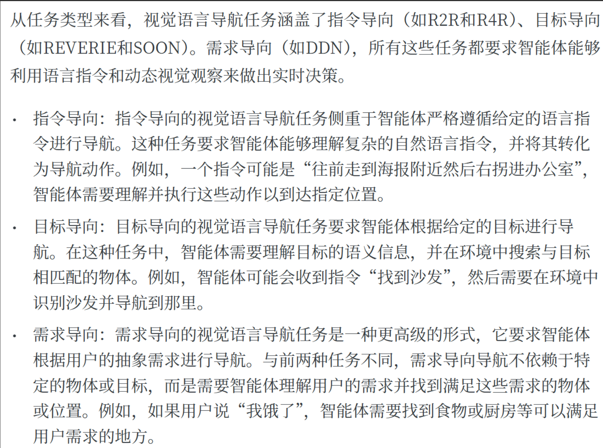

显然VLMaps属于目标导向任务。但和一般的目标导向任务不同。因为它并非从头开始、根据指令的描述在房屋内寻找详细描述的目标对象（例如REVERIE和SOON数据集，指令step-by-step地指导agent导航至某个位置。Agent自主导航需要首先搜索更大范围的区域，然后根据视觉场景和指令逐渐缩小搜索范围）。

是基于地图或全局视角的VLN（智能体在开始时就拥有全局或半全局地图（如拓扑图、语义图、全景图数据库），任务更偏向视觉语言路径规划），而非传统自我中心视觉导航（智能体仅能看到当前视野，必须通过语言理解 + 逐步感知决策完成任务。）

SOON：

VLMaps可分为两阶段：

1.离线探索与建图。机器人首先自主地、不受任何具体指令驱动地探索整个环境，利用其传感器和SLAM技术，构建一个几何精确且语义丰富的世界模型——语义地图。这个过程完成后，机器人对整个环境的布局和其中物体的语义信息已经有了全局性的、持久化的认知。  

2.在线查询与导航。 当接收到“找到沙发”或“去沙发和电视中间”的指令时，这不再是一个探索问题，而变成了一个数据库查询问题。机器人直接在自己已经构建好的VLMap上，通过计算语言特征和地图特征的相似度来瞬间定位目标物体或空间区域的坐标 。一旦坐标确定，任务就简化为了一个经典的路径规划问题：从当前点到目标点，如何利用生成的障碍物地图规划出一条最优路径 。

区别二：VLMaps是一个high-level的任务规划器，将一个复杂、模糊的自然语言指令，分解成一个由多个具体、有序的子目标（包含子目标的的具体坐标），而不考虑low-level的动作规划和生成、不会解码出动作。对于底层运动规划与执行，论文中交代：We navigate to these coordinates using an off-the-shelf navigation stack

综述中对VLMaps的定位：

(Vision-and-Language Navigation Today and Tomorrow: A Survey in the Era of Foundation Models, TMLR 2024)

World Model: Learning and Representing the Visual Environments

一个世界模型有助于agent理解其周围环境、预测其行为将如何改变世界状态，并使其感知和行动与语言指令保持一致。将观察到的视觉历史编码为记忆∈世界模型。

许多研究还提议将自上而下的视图信息（例如网格地图（Wang 等人，2023g；Liu 等人，2023a）、语义地图（Hong 等人，2023a；Huang 等人，2023a；Georgakis 等人，2022；Anderson 等人，2019；Chen 等人，2022a；Irshad 等人，2022）、局部度量地图（An 等人，2023）、局部邻域地图（Gopinathan 等人，2023））纳入观察历史的建模中。

---
论文中对比的：

LM-Nav：

首先，机器人探索环境，然后视觉导航模型 (VNM)创建该区域的拓扑地图。该地图是一个拓扑图，其中节点代表特定的摄像机图像（视点），边代表机器人是否可以在这些视点之间导航以及它们的距离（由VNM推断）。

当用户提供自然语言指令（例如，“经过停车标志到蓝色卡车”）时，像 GPT-3 这样的LLM会解析该句子，提取一个简单、有序的关键对象列表，并将其称为地标（例如["stop sign", "blue truck"]）。

然后，CLIP 这样的视觉语言模型会提取每个地标，并将其与拓扑图中的所有图像进行比较，以找到与该地标最匹配的单个图像节点。最后，图搜索算法会通过这一系列已识别的图像节点规划出最高效的路径，然后 VNM 会通过从一个照片航点导航到下一个航点来执行该规划。

和VLMaps的不同点：

- LM-Nav：使用稀疏拓扑图。VLMaps：构建密集、连续的几何和语义地图。

- LM-Nav： LLM 充当一个简单的地标提取器。它将复杂的句子简化为名词列表；VLMaps： LLM 充当生成代码的规划器。

- LM-Nav执行节点匹配。它在图中寻找与地标描述相对应的单个最佳图像节点。目标始终是地图上已经存在的离散点。 VLMaps：执行空间查询。

CoW：已经查无此文