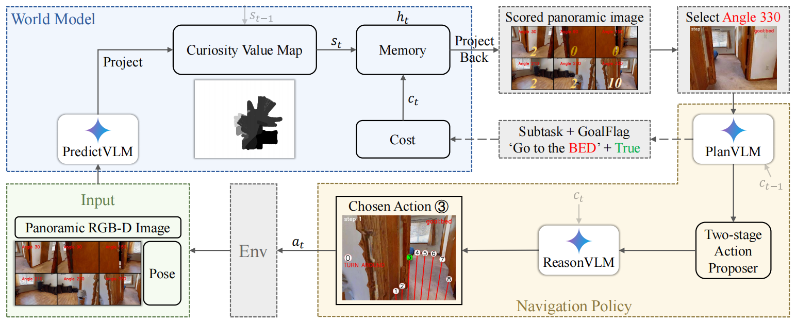
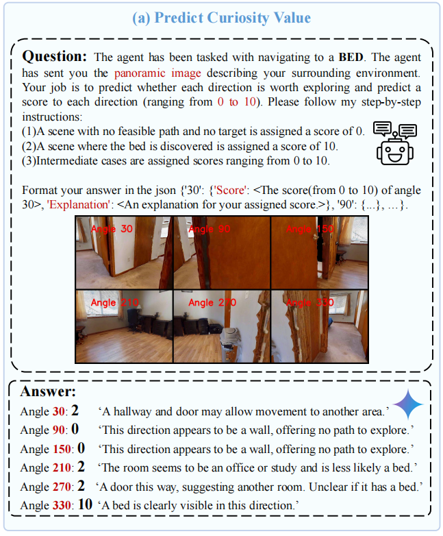
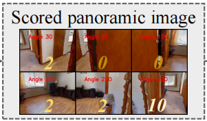
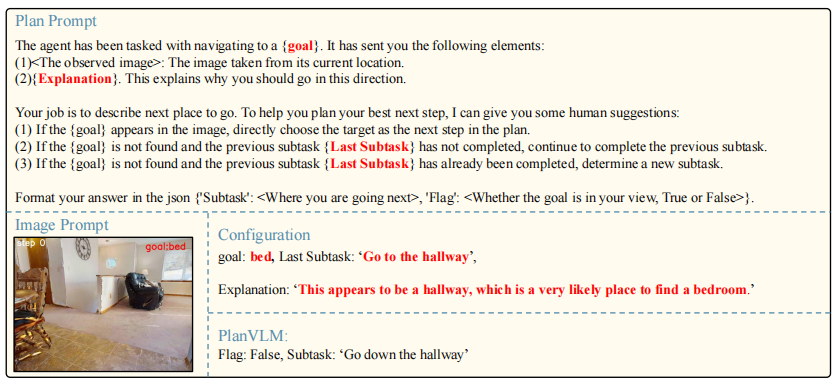

### 对这篇文章要解决的VLN任务进行分析：
WMNav 解决的是在连续环境中 (Habitat模拟器) 、object goal目标导向（数据集是HM3Dv1等）、No prior exploration (无导航前探索)的VLN任务。

论文在第三部分“Task Definition”中明确指出，agent的动作$a_{t}$采用极坐标$(r_{t},\theta_{t})$来表示，其中$r_{t}$代表移动距离，$\theta_{t}$代表动作方向 11。这是一种连续的动作空间，允许agent在环境中自由移动，而不是在离散的、预先定义的导航节点（viewpoints）之间跳转

论文的摘要和引言部分多次强调，该任务是“Zero-Shot Object Navigation (ZSON)”（零样本目标导航），要求agent在“unseen environment”（未见过的环境）中定位一个特定物体 。

### 论文研究动机：
现有的导航方法存在诸多局限性：

VLM潜力未被挖掘： 尽管基于VLM的agent展现了很强的感知和决策能力，但它们缺乏一个模块化的“世界模型”设计，无法通过预测未来状态来减少高风险和高成本的环境交互。

传统方法局限：

- 网络驱动型 (如RL/IL) 依赖大量训练数据和计算资源 。
- 地图驱动型 依赖复杂且耗时的精确地图构建 ，并且没有充分利用VLM从第一人称RGB图像中学习到的能力 。

现有VLM方法的不足：

- 一些方法（如VLMNav）受限于有限的egocentric（第一人称）视角 。

- 另一些方法（如VLFM）使用的VLM（BLIP-2）推理能力有限，难以应对复杂规划 。

核心洞察： 人类在导航时，可以根据视觉线索和常识（如“浴室里通常没有沙发”）来“想象”房间布局和预测行动后果 。论文假设，VLM既然在大量第一人称视角图像上训练过，它们也应该获得了足够的常识来充当世界模型 ，模拟人类的选择和行动预期。论文的方法将VLM置于世界模型框架之中，并将其应用于导航的所有过程中，包括预测、规划、推理、行动等。

之前有工作把LLM作为世界模型用来规划，但是它相比于VLM，难以适应视觉接地的决策任务。

VLM世界模型要：预测各种场景中，存在目标物体的可能性(likelihood)，这个值将被存储进一个叫做 online Curiosity Value Map的2D平面图中。

### 论文提出的方法分析：
Memory building 方式: Map-based Memory(Explicit Memories) + World Model

论文标题 和摘要 就点明了这是一个“World Model-based”的框架。该方法的核心是利用VLM来充当世界模型 ，其功能是“predicts possible outcomes of decisions”（预测决策的可能结果） 以及“predict and simplify the future state of the environment”（预测和简化未来的环境状态）。

在传统的世界模型中（例如用于自动驾驶或物理模拟），“预测未来状态”通常意味着预测下一个视觉帧（例如，如果我左转，我会看到一堵墙）。

但在这篇论文的目标导航任务中，agent 最关心的“未来状态”并不是下一秒的图像，而是**“这个决策（走这个方向）是否会让我更接近目标？”

它预测的是“语义上的未来”，而非“视觉上的未来”： 世界模型中的PredictVLM 被要求利用其常识进行“想象” 。当它看到一个方向是“A hallway and door”（一个走廊和门），它会预测这个方向的结果是“may allow movement to another area”（可能通向另一个区域） 。当它看到另一个方向是“The room seems to be an office or study”（一个办公室或书房），它会预测这个方向的结果是“is less likely a bed”（不太可能有床）。这和一些方法(ApexNav)使用BLIP这样光比较图像和目标之间的语义相似性是有区别的。

它使用了一个名为“Curiosity Value Map”（好奇心价值地图）的显式2D地图结构来存储预测，但这个地图的内容（即“好奇心价值”）是由作为世界模型的VLM 预测 产生的，而不是像传统Metric Map那样直接测量和存储环境的物理空间布局（如障碍物）。

---

全流程

Step 1: PredictVLM (预测模块)

PredictVLM (预测模块)输入： 全景RGB-D图像 $I_t^{pan}$（由agent原地旋转6个角度拍摄合成）。VLM被要求扮演世界模型，预测全景图中每个方向（共6个）的“好奇心价值”（Curiosity Value），即在该方向找到目标的可能性，并给出一个0-10分的评分。示例：目标是“床”。VLM会给“通向卧室的门”一个高分（如10分），给“一堵墙”一个0分。

Step 2: 构建Curiosity Value Map (CVM - 好奇心价值地图，按论文的意思仍属于世界模型)

功能： 这是agent的记忆模块。它是一张2D的俯视栅格地图，存储了环境中每个位置的好奇心价值。更新：投影 (Project)： 如图所示，PredictVLM 预测出的6个方向的得分，会利用深度信息被投影 (Projection) 到当前的2D俯视地图 $M_t^{nav}$ 上。合并 (Merge)： 系统会取最小值，合并当前预测的地图 $M_t^{nav}$ 和上一步的记忆地图 $M_{t-1}^{cv}$，得到当前时刻的记忆地图 $M_t^{cv}$ 。这确保了agent一旦探索过某地（价值变低），就不会轻易“忘记”。

方向选择更新后的 CVM 记忆 $M_t^{cv}$ 会被投影回 (Project Back) 当前的全景视角，计算每个方向的平均好奇心得分。得分最高的那个方向（例如下图中的 "Angle 330"）所对应的图像，将被送入导航策略模块。

✅ **Tips** 
既然 PredictVLM 已经给出了6个方向的直接评分，为什么不直接用最高分，而是要绕一圈“投影到地图 -> 再投影回视角”？

简短的回答是：为了融合“记忆”。

PredictVLM 的直接输出是一种**“瞬时感知”或“反应式”**的判断。它只代表VLM在 当前这一刻 认为哪个方向 看起来 最有可能通向目标（例如，“那扇门看起来像通往卧室”）。

而好奇心价值地图 (CVM) 是 agent 的“长期记忆”。它记录了 agent 去过哪里 以及 哪里已经被探索过但没有发现目标。这个“投影 -> 再投影回”的循环，正是将“瞬时感知”与“长期记忆”相融合的关键步骤：问题在于“重复探索”： 假设 agent 面前有A、B两条路。PredictVLM 认为 A 路（走廊）得分更高。Agent 选择了 A 路，走到底发现是死路（没有床）。Agent 回到原点。此时，它再次观察，PredictVLM 还是会认为 A 路（走廊）看起来很可疑，可能还是会给它高分。如果只依赖 PredictVLM 的直接打分，agent 可能会陷入循环，反复探索同一条死路。

CVM (记忆) 如何解决这个问题：

当 agent 探索了 A 路并发现是死路后，CVM 会将 A 路对应在俯视地图上的区域的好奇心价值更新为 0（或一个很低的值）。这个更新是通过 min 运算实现的：M(u, v) = min(M_t-1(u, v), M_nav(u, v)) 。M_t-1 是“记忆”（A路已探索，值为0），M_nav 是“当前感知”（A路看起来像走廊，值>0）。min(0, ...) 结果还是 0。这就是关键： 当 agent 回到原点时，虽然 PredictVLM 再次对 A 路给出了一个正分，但这个分数投影到 CVM 上时，CVM “记得” 这里已经是0分了。因此，当 CVM 再投影回 (Project Back) 全景视角时 ，A 路方向因为其对应的地图记忆是0，所以它的最终得分会是0（或非常低）。此时，agent 才会去选择 B 路（即使 B 路一开始 PredictVLM 给的瞬时分数更低）。

step3: PlanVLM (规划模块, navigation policy)

任务： 对选定的方向进行更具体的规划 。

功能： 采用子任务分解 (Subtask Decomposition) 策略 。VLM会根据上一轮的子任务文本和当前图像（从上一步选择来的），生成一个新的子任务（例如，从“找到卧室”分解为“走向走廊”）和一个目标是否可见的标志 (GoalFlag) 。

动机： 将一个困难的长期目标（找床）分解为一系列简单的短期子任务，能为agent提供更密集的反馈 。

step4: Two-stage Action Proposer & ReasonVLM (行动模块)

任务： 根据 PlanVLM 生成的子任务，选择一个最终的 $(r, \theta)$ 动作。机制： 这是一个两阶段策略，如下图所示。ReasonVLM会根据 GoalFlag 切换两种模式：

阶段一：探索阶段 (Exploration Stage) 时机： 当 GoalFlag 为 False (未找到目标) 时 。流程： "Action Proposer" 在可选区域中采样一系列候选动作（图中的红点），"ActionVLM" (即 ReasonVLM) 会选择一个最有助于完成当前子任务（如“Go to the hallway”）的动作。

阶段二：接近目标阶段 (Goal-approaching Stage) 时机： 当 GoalFlag 为 True (已找到目标) 时。流程： "Goal Proposer" 会在目标附近进行密集采样，"GoalVLM" (即 ReasonVLM) 会选择一个能最精确移动到目标位置（如“Position 5”）的动作。

