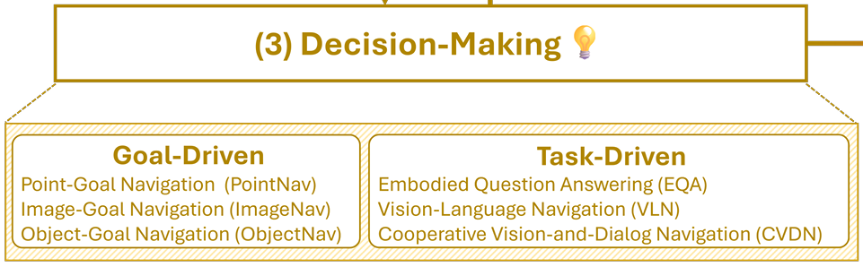
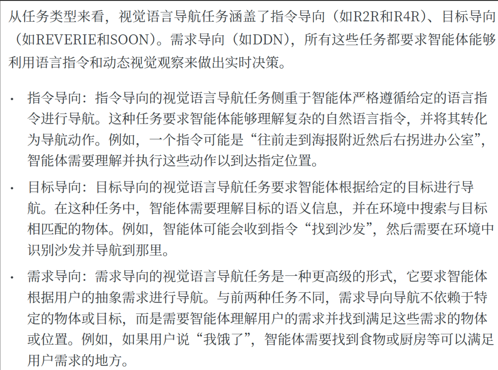
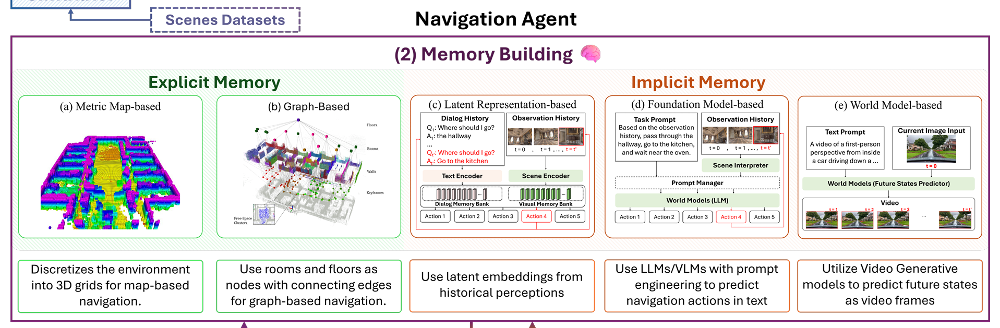
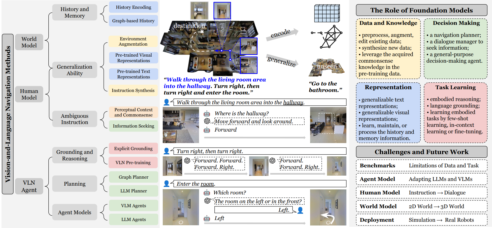

# Navigation_Papers_Notes

自用，总结入门 VLN 的心路历程（）

---

## 以下是 Robot Navigation 的论文和笔记整理：

### 🧭 Visual Exploration & Visual Navigation

| Year | Venue | Paper Title | Labels | Link |
|------|--------|--------------|---------|------|
| 2017 | arxiv | Unifying Map and Landmark Based Representations for Visual Navigation | 连续,PointNav,No prior exploration,Map-based memory | [📄 Notes] |
| 2018 | ICLR | SEMI-PARAMETRIC TOPOLOGICAL MEMORY FOR NAVIGATION | 离散,object goal,Pre-recorded exploration,Graph-based memory | [📄 Notes] |
| 2020 | ICLR | Learning to Explore Using Active Neural SLAM | 连续,PointNav,No prior exploration,Map-based memory | [📄 Notes](./Notes/ANSlam.md) |
| 2020 | ECCV | Occupancy Anticipation for Efficient Exploration and Navigation | 连续,PointNav,No prior exploration,Map-based memory | [📄 Notes] |
| 2020 | ECCV | Seeing the Un-Scene:Learning Amodal Semantic Maps for Room Navigation | 连续,PointNav,No prior exploration,Map-based memory | [📄 Notes] |
| 2023 | ICRA | Visual Language Maps for Robot Navigation | 连续,ObjectNav,Pre-recorded exploration,Map-based memory | [📄 Notes](./Notes/VLMaps.md) |

---

### 🗺️ VLN (Vision-Language Navigation)

| Year | Venue | Paper Title | Labels | Link |
|------|--------|--------------|---------|------|
| 2018 | CVPR | Vision-and-Language Navigation (Anderson et al.) | ... | [📄 Notes] |
| 2021 | ICCV | HAMT: Hierarchical Attention Memory Transformer for VLN | ... | [📄 Notes] |
| 2025 | arxiv | TRAVEL: Training-Free Retrieval and Alignment for Vision-and-Language Navigation | 离散,route goal,Pre-recorded exploration,Graph-based memory,Graph Planner | [📄 Notes](./Notes/TRAVEL.md) |
| 2025 | arxiv | FlexVLN: Flexible Adaptation for Diverse Vision-and-Language Navigation Tasks | 离散,object goal,No prior exploration,Foundation Model-based + Explicit Memories,LLM Planner | [📄 Notes](./Notes/FlexVLN.md) |
| 2025 | RA-L 25 | ApexNav: An Adaptive Exploration Strategy for Zero-Shot Object Navigation with Target-centric Semantic Fusion | 连续,object goal,No prior exploration,Map-based Memory(Explicit Memories) + Foundation Model-based 推理,VLM Agent | [📄 Notes](./Notes/ApexNav.md) |
| 2025 | arxiv | JanusVLN: Decoupling Semantics and Spatiality with Dual Implicit Memory for Vision-Language Navigation | 连续,route goal,No prior exploration,Implicit Memory,VLM Agent | [📄 Notes](./Notes/JanusVLN.md) |
| 2025 | CoRL 25 | GC-VLN: Instruction as Graph Constraints for Training-free Vision-and-Language Navigation | 连续,route goal,No prior exploration,...,Graph Planner | [📄 Notes](./Notes/GC-VLN.md) |
| 2025 | IROS 25 Oral | WMNav: Integrating Vision-Language Models into World Models for Object Goal Navigation | 连续,object goal,No prior exploration,Map-based Memory(Explicit Memories) + World Model,VLM Agents | [📄 Notes](./Notes/WMNav.md) |
| 2025 | arxiv | LOVON: Legged Open-Vocabulary Object Navigator | 连续,object goal,No prior exploration,...,VLM Agent | [📄 Notes] |
| 2025 | CVPR 25 | Do Visual Imaginations Improve Vision-and-Language Navigation Agents? | 连续,route goal,No prior exploration,...,Graph Planner | [📄 Notes] |
| 2025 | arxiv | HA-VLN: A Benchmark for Human-Aware Navigation in Discrete-Continuous Environments with Dynamic Multi-Human Interactions, Real-World Validation, and an Open Leaderboard | Benchmark | [📄 Notes] |
| 2025 | CoRR 25 | Unseen from Seen: Rewriting Observation-Instruction Using Foundation Models for Augmenting Vision-Language Navigation | 连续,route goal,No prior exploration,...,Graph Planner | [📄 Notes] |
| 2025 | CVPR 25 | ForesightNav: Learning Scene Imagination for Efficient Exploration | 连续,route goal,No prior exploration,...,Graph Planner | [📄 Notes] |
| 2025 | arxiv | CityNavAgent: Aerial Vision-and-Language Navigation with Hierarchical Semantic Planning and Global Memory | 连续,route goal,No prior exploration,...,Graph Planner | [📄 Notes] |
| 2025 | arxiv | BeliefMapNav: 3D Voxel-Based Belief Map for Zero-Shot Object Navigation | ... | [📄 Notes] |
| 2025 | arxiv | OctoNav: Towards Generalist Embodied Navigation | ... | [📄 Notes] |
| 2025 | arxiv | CorrectNav: Self-Correction Flywheel Empowers Vision-Language-Action Navigation Model | ... | [📄 Notes] |
| 2025 | arxiv | Streamvln: Streaming vision-and-language navigation via slowfast context modeling | ... | [📄 Notes] |
| 2025 | RSS | Uni-NaVid: A Video-based Vision-Language-Action Model for Unifying Embodied Navigation Tasks | ... | [📄 Notes] |
| 2025 | RSS | NaVILA: Legged Robot Vision-Language-Action Model for Navigation | ... | [📄 Notes] |
| 2025 | ICCV | Move to Understand a 3D Scene: Bridging Visual Grounding and Exploration for Efficient and Versatile Embodied Navigation	 | ... | [📄 Notes] |
| 2025 | ACL | NavRAG: Generating User Demand Instructions for Embodied Navigation through Retrieval-Augmented LLM | ... | [📄 Notes] |
| 2025 | ICLR | Bootstrapping Language-Guided Navigation Learning with Self-Refining Data Flywheel | ... | [📄 Notes] |
| 2025 | ICCV | SAME: Learning Generic Language-Guided Visual Navigation with State-Adaptive Mixture of Experts | ... | [📄 Notes] |
| 2025 | ICCV | NavMorph: A Self-Evolving World Model for Vision-and-Language Navigation in Continuous Environments | ... | [📄 Notes] |
| 2025 | arxiv | EvolveNav: Self-Improving Embodied Reasoning for LLM-Based Vision-Language Navigation | ... | [📄 Notes] |
---

✅ **Tips**  
### 把Visual Exploration & Visual Navigation和 VLN 分开

​​VLN的任务目标​​：通常是“遵循自然语言指令”。其核心是​​理解并执行​​指令所描述的路径和意图。这个过程本身就隐含了​​时序性和逐步性​​。评价一个VLN智能体好坏，不仅是看它最终是否到达了终点，还要看它走过的路径是否合乎指令的描述（比如，指令说“在厨房门口停下”，它就不能直接开进厨房深处）。VLN任务的一个关键目标是让智能体像人一样​​根据所见所闻进行推理和决策​​，而不是简单地调用一个全局路径规划器。更像是对“视觉语言智能”的探路石研究。

早期的一些基于SLAM的机器人导航可能只是直接或间接的Point Navigation。最近的一些工作虽然有自然语言的成分，但它并没有实现“视觉语言智能”，只是用来帮助确定目标位置，最终又变成了Point Navigation

### 连续和离散环境

按照所解决的任务是离散或者连续的环境来划分。比如R2R和VLN-CE就分别是离散和连续环境的数据集。离散环境应是由若干个可导航节点（viewpoints）构成的导航图。

### object goal 或 route goal

来源：Vision-Language Navigation: A Survey and Taxonomy

即目标导向和指令导向

### 依据导航前对环境的探索程度 No prior exploration 或 Pre-recorded prior exploration

来源：On Evaluation of Embodied Navigation Agents

### Memory Building

来源：A Survey of Robotic Navigation and Manipulation with Physics Simulators in the Era of Embodied AI

### 依据论文的方法侧重于什么模块

来源：Vision-and-Language Navigation Today and Tomorrow: A Survey in the Era of Foundation Models

